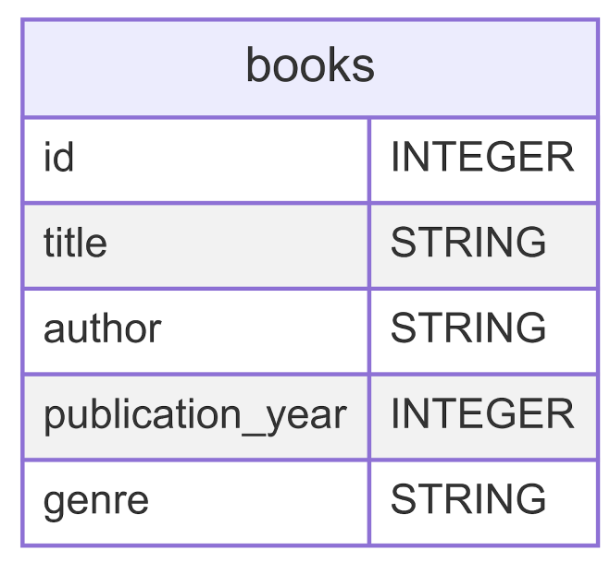

# Assignment #5 - Library Database

**TASK**: Create a `books` table in a library database using Python’s `sqlite3` module. 


This table will store a books `id`, `title`, `author`, `publication_year`, and `genre`. You will add the following values to the books table:

| `title` | `author` | `publication_year` | `genre` | 
| --------| -------- | ------------------ | ------- |
| The Great Gatsby | F. Scott Fitzgerald | 1960 | Fiction |
| To Kill and Mockingbird | Harper Lee| 1960 | Dystopian Fiction |
| 1984 | George Orwell | 1949 | Fiction |
| The Lord of the Rings' | J.R.R. Tolkien | 1954 | Fantasy |
| The Catcher in the Rye | J.D. Salinger | 1951 | Fiction |
| One Hundred Years of Solitude | Gabriel Garcia Marquez | 1967 | Magical Realism |
| The Hitchhikers Guide to the Galaxy | Douglas Adams | 1979 | Science Fiction |
| The Handmaids Tale | Margaret Atwood | 1980 | Dystopian Fiction |
| War and Peace | Leo Tolstoy | 1869 | Fiction |
| Ulysses | James Joyce | 1922 | Fiction |

Once you have these 10 items in the database, you will query the database in order to print out and update information stored in your cities in your table.

After you have verified that the table has been created with these values, you need to do the following:
- Create a variable called `fiction` that will store all the rows in the table that have a genre of fiction.
- Update the `publication_date` of The Handmaid's Tale to 1985.
- Delete the row that contains the book 1984 from your database.

## Grading Your Work
This assignment can grade itself! To setup the autograding, you should do the following:
1. Clone this file to your local machine using the command
```bash
git clone PASTE_URL_HERE
```
2. Open the downloaded file in your VS Code editor.
3. In the left hand sidebar, press the "Testing" menu represented by the picture of a flask.
4. Click "Configure Python Tests".
5. You'll have two options to select. Select **pytest**.
6. Select the folder where the tests live. You can simply select `. Root directory`.
7. You can now run the tests by pressing the play icon. A passing test will get a ✅ and a failing test will get a ❌.
8. Run the tests as you code and by the end it should be all ✅ if you have followed the specifications for this assignment!

## Unit Tests

### Unit Test Explanations
- `test_books_table_exists`: Verifies that the `books` table exists in the database.
- `test_books_table_columns`: Checks that the `books` table has the correct columns. 
- `test_fiction_genre`: Checks that the `fiction` variable contains all rows that have a genre of fiction. Checks that the first value in the variable is 'The Great Gatsby'.
- `test_handmaids_tale_update`: Checks that the `publication_year` of the The Handmaid's Tale has been updated to 1985.
- `test_1984_deletion`: Checks that 1984 has been deleted from the database.
- `test_final_book_table_length`: Tests that the final books table has 9 rows.
- `test_final_books_table_contents`: Checks that the books table has the correct values after running update and delete commands.